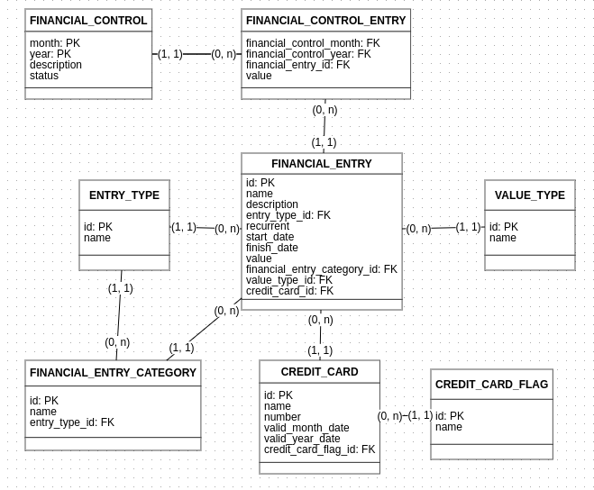

# Bem Vindo ao Controle Financeiro Pessoal!

Este projeto é um backend de uma aplicação cujo propósito é auxiliar o usuário no controle de seus gastos mensais, registrando receitas, despesas e reservas num só lugar possibilitando ao usuário uma visão mais ampla de como sua vida financeira acontece, de onde vem as receitas, quanto elas são, e pra onde elas estão indo. Desta forma o usuário poderá tomar decisões mais estratégicas alinhadas com seus objetivos pessoais.


# ARQUIVOS

Segue abaixo uma descrição resumida da estrutura do projeto

## database

Arquivos referente à base de dados da apliacação

## model

Classes que representam os modelos de dados manipulados pela aplicação.

## schemas

Classes que representam os dados de entrada e saida da aplicação

## services

Classes que representam as operações e a implementação das regras de negócio

## repository

Classes que representam as operações de manipulação de dados no banco de dados

## api_json.json

Arquivo JSON da API para importar no POSTMAN.

# COMO EXECUTAR


Será necessário ter todas as libs python listadas no `requirements.txt` instaladas.
Após clonar o repositório, é necessário ir ao diretório raiz, pelo terminal, para poder executar os comandos descritos abaixo.

> É fortemente indicado o uso de ambientes virtuais do tipo [virtualenv](https://virtualenv.pypa.io/en/latest/installation.html).

```
(env)$ pip install -r requirements.txt
```

Este comando instala as dependências/bibliotecas, descritas no arquivo `requirements.txt`.

Para executar a API  basta executar:

```
(env)$ flask run --host 0.0.0.0 --port 5000
```

Em modo de desenvolvimento é recomendado executar utilizando o parâmetro reload, que reiniciará o servidor
automaticamente após uma mudança no código fonte. 

```
(env)$ flask run --host 0.0.0.0 --port 5000 --reload
```

Abra o [http://localhost:5000/#/](http://localhost:5000/#/) no navegador para verificar o status da API em execução.


# DOCUMENTAÇÕES

Segue abaixo a documentação deste projeto

## DER

Segue abaixo o diagrama entidade e relacionamento do projeto



## API Documentation - SWAGGER

Abra o [http://localhost:5000/docs](http://localhost:5000/docs) no navegador para verificar a documentação das APIs.